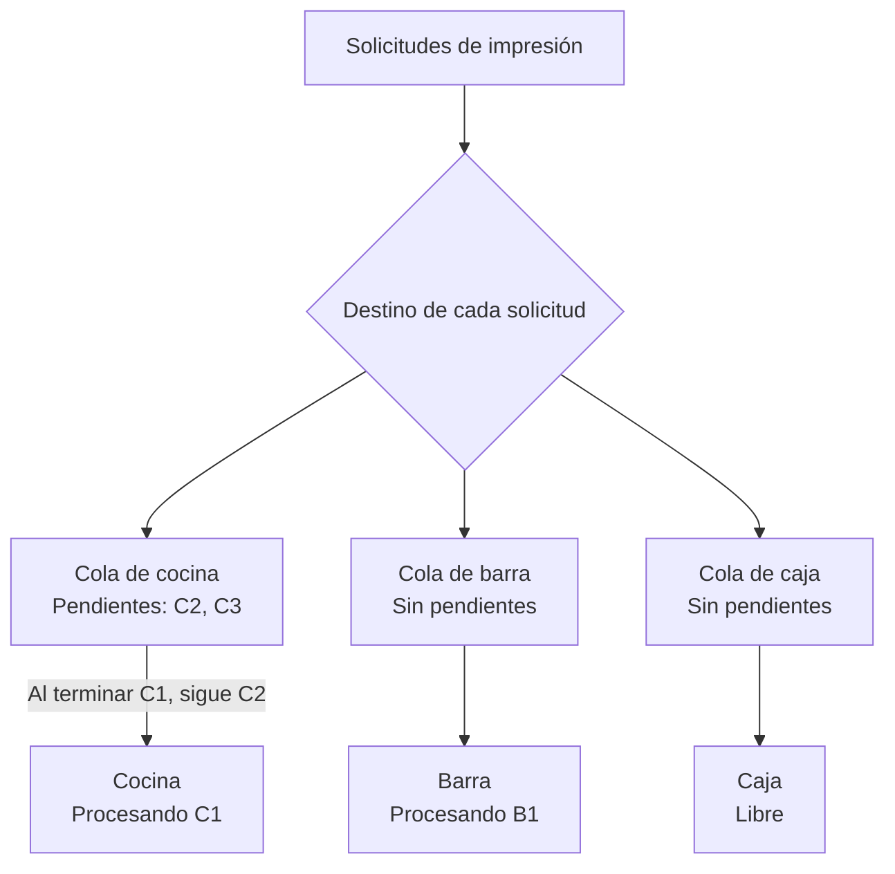

# Colas de impresión

El puente mantiene una cola FIFO en memoria por destino de impresión. Tickets,
pruebas de impresión, pruebas de caracteres y apertura de cajón esperan su turno
hasta que la operación anterior termine, incluido el cierre del transporte y el
reintento Bluetooth existente. Destinos diferentes trabajan en paralelo.

La identidad corresponde al transporte: host y puerto para red, nombre de cola
de Windows, ruta serial para Bluetooth o VID/PID para USB directo. Dos registros
con el mismo destino comparten cola. No se detectan equivalencias entre alias de
red ni entre transportes diferentes. USB directo agrupa por VID/PID porque ese es
el selector que utiliza actualmente el adaptador.

## Ejemplo: impresoras con distinta carga

Cocina está procesando C1 y tiene C2 y C3 pendientes, en ese orden. Barra puede
procesar B1 al mismo tiempo. Caja está libre y puede empezar en cuanto llegue
una solicitud: no necesita esperar a cocina.



Este instante se reflejaría en `printers[].runtime.queue` así:

| Impresora | `active` | `pending` |
| --- | --- | --- |
| Cocina | `true` | `2` |
| Barra | `true` | `0` |
| Caja | `false` | `0` |

Cada destino admite una sola operación activa. La cantidad de pendientes de
cocina no retrasa a barra ni a caja.

## Ejemplo: dos solicitudes a la misma impresora

A entra primero y B llega mientras A sigue en curso. B conserva su turno y
comienza cuando termina la operación de A, incluido el cierre del transporte.
Cada solicitud HTTP recibe su propia respuesta.

```mermaid
sequenceDiagram
    participant A as Solicitud A
    participant B as Solicitud B
    participant Q as Cola de cocina
    participant P as Transporte de cocina

    A->>Q: Encolar ticket A
    Q->>P: Abrir y enviar A
    activate P
    B->>Q: Encolar ticket B
    Note over B,Q: B espera; su HTTP sigue pendiente
    Note over Q,P: El turno incluye envío, cierre y reintento existente
    P-->>Q: Operación A termina
    deactivate P
    Q-->>A: Respuesta de A: éxito o error
    Q->>P: Abrir y enviar B
    activate P
    P-->>Q: Operación B termina
    deactivate P
    Q-->>B: Respuesta de B: éxito o error
```

El diagrama simplifica el orden de entrega de las respuestas HTTP: el siguiente
turno depende de que termine la operación anterior, no de que el cliente haya
recibido su respuesta. Si A falla y su operación termina, B puede continuar.
Si A nunca termina, la cola de cocina sigue esperando; las otras colas avanzan.

Estos turnos también incluyen pruebas y apertura de cajón. Si dos
configuraciones apuntan a la misma conexión de impresora, entran en la misma
cola aunque tengan nombres distintos.

## API y diagnóstico

Las rutas y sus respuestas existentes se conservan. `POST /print` espera tanto
el turno como la ejecución antes de responder. Un error afecta a su solicitud y
permite pasar a la siguiente. Los clientes deben contemplar el tiempo de espera
en sus límites HTTP.

`GET /api/status` añade a cada `printers[].runtime`:

```json
{
  "queue": { "active": true, "pending": 3 }
}
```

`active` indica una operación en curso; `pending` excluye esa operación.
Los eventos técnicos `print_queue_entered` y `print_queue_started` aparecen en
los diagnósticos existentes; el segundo incluye `waitMs` en milisegundos.

## Límites

- No hay persistencia: cerrar el proceso descarta pendientes.
- No se deduplica por `jobId`: repetir una solicitud vuelve a imprimir.
- Se conservan errores, reintentos y tiempos de espera actuales. Un transporte
  que no termina mantiene ocupada su cola, sin liberar el turno anticipadamente.
- La cola coordina este proceso; no controla envíos de otros programas.
- Las definiciones y el contenido del trabajo se copian al entrar. Cambios
  posteriores de configuración no modifican los trabajos pendientes.
- El éxito conserva su significado actual de envío al transporte; no añade
  confirmación de impresión física.
